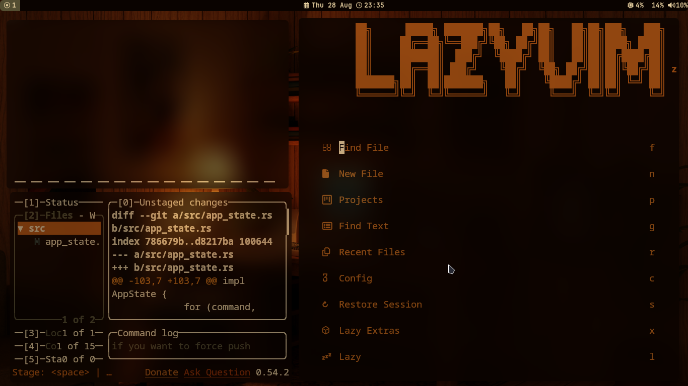

# i3wm-minimal-setup

## Included Configurations

### i3 Window Manager
- Minimal window manager configuration
- Custom keybindings and workspace setup
- Application launcher and system tray configuration
- Multi-monitor support

### Fish Shell
- Clean shell prompt and aliases
- Useful functions and abbreviations
- Environment variables setup
- Plugin recommendations

### Kitty Terminal
- Modern terminal emulator settings
- Custom color scheme and fonts
- Performance optimizations
- Keyboard shortcuts
