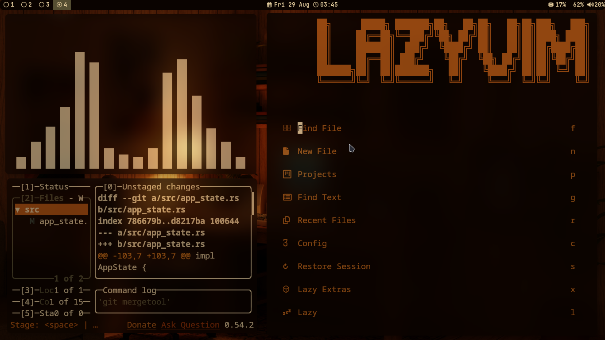
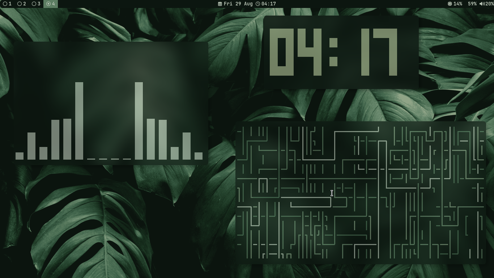
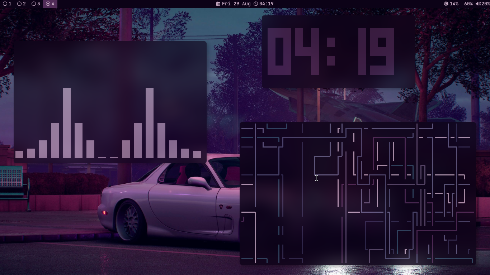
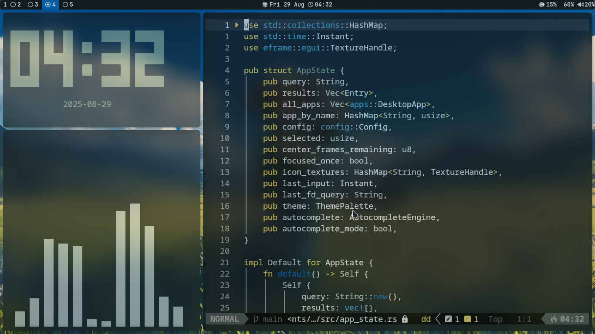

# i3wm-minimal-setup




## 🛠️ System Dependencies

### Core Components
- **Window Manager**: [i3wm](https://i3wm.org/) - Tiling window manager
- **Terminal**: [Kitty](https://sw.kovidgoyal.net/kitty/) - GPU-accelerated terminal emulator
- **Shell**: [Fish](https://fishshell.com/) - Smart and user-friendly command line shell

### Essential Tools
- **Display Manager**: [LightDM](https://github.com/canonical/lightdm) or similar
- **Audio**: [PulseAudio](https://www.freedesktop.org/wiki/Software/PulseAudio/) with `pactl` - Audio control
- **Network**: [NetworkManager](https://wiki.gnome.org/Projects/NetworkManager) with `nm-applet` - Network management
- **Screen Lock**: [i3lock](https://i3wm.org/i3lock/) with `xss-lock` - Screen locking
- **Application Launcher**: [dmenu](https://tools.suckless.org/dmenu/) - Dynamic menu
- **Authentication**: [polkit-gnome](https://gitlab.gnome.org/Archive/PolicyKit-gnome) - Policy kit agent

### Visual Enhancement
- **Wallpaper Manager**: [pywal](https://github.com/dylanaraps/pywal) - Automatic colorscheme generation
- **Status Bar**: [Polybar](https://polybar.github.io/) - Highly customizable status bar
- **Compositor**: [Picom](https://github.com/yshui/picom) - Lightweight compositor for transparency/shadows


### Fonts
- **Primary**: [JetBrains Mono Nerd Font](https://github.com/ryanoasis/nerd-fonts) - Programming font with icons
- **Fallback**: [Cascadia Code](https://github.com/microsoft/cascadia-code) - Microsoft's terminal font

## 📦 Installation Guide

### Arch Linux (using pacman & AUR)
```bash
# Core components
sudo pacman -S i3-wm kitty fish

# Essential tools
sudo pacman -S lightdm pulseaudio pactl networkmanager network-manager-applet i3lock xss-lock dmenu polkit-gnome

# Visual enhancement
sudo pacman -S python-pywal polybar picom feh
yay -S albert

# Development tools
curl -fsSL https://bun.sh/install | bash
curl -o- https://raw.githubusercontent.com/nvm-sh/nvm/v0.39.0/install.sh | bash

# Fonts
sudo pacman -S ttf-jetbrains-mono-nerd ttf-cascadia-code
```

### Ubuntu/Debian (using apt)
```bash
# Core components
sudo apt update
sudo apt install i3 kitty fish

# Essential tools
sudo apt install lightdm pulseaudio-utils network-manager network-manager-gnome i3lock xss-lock suckless-tools policykit-1-gnome

# Visual enhancement
pip install pywal
sudo apt install polybar picom feh

# Development tools
curl -fsSL https://bun.sh/install | bash
curl -o- https://raw.githubusercontent.com/nvm-sh/nvm/v0.39.0/install.sh | bash

# Fonts (manual installation required for Nerd Fonts)
sudo apt install fonts-jetbrains-mono
```

### Fedora (using dnf)
```bash
# Core components
sudo dnf install i3 kitty fish

# Essential tools
sudo dnf install lightdm pulseaudio-utils NetworkManager nm-applet i3lock xss-lock dmenu polkit-gnome

# Visual enhancement
pip install pywal
sudo dnf install polybar picom feh

# Development tools
curl -fsSL https://bun.sh/install | bash
curl -o- https://raw.githubusercontent.com/nvm-sh/nvm/v0.39.0/install.sh | bash

# Fonts
sudo dnf install jetbrains-mono-fonts
```

### Post-Installation Steps
```bash
# Set fish as default shell
chsh -s $(which fish)

# Create necessary directories
mkdir -p ~/.config/{i3,kitty,fish,polybar,picom}
mkdir -p ~/Wallpapers

# Install Nerd Fonts (if not available in package manager)
wget https://github.com/ryanoasis/nerd-fonts/releases/download/v3.0.2/JetBrainsMono.zip
unzip JetBrainsMono.zip -d ~/.local/share/fonts/
fc-cache -fv
```


## Included Configurations

### i3 Window Manager
- Minimal window manager configuration
- Custom keybindings and workspace setup
- Application launcher and system tray configuration
- Multi-monitor support

### Fish Shell
- Clean shell prompt and aliases
- Useful functions and abbreviations
- Environment variables setup
- Plugin recommendations

### Kitty Terminal
- Modern terminal emulator settings
- Custom color scheme and fonts
- Performance optimizations
- Keyboard shortcuts

### Dynamic Color Schemes
The colorscheme automatically adapts to your wallpaper, creating a cohesive visual experience across all applications.






